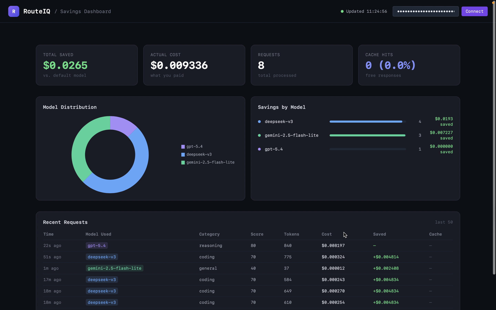
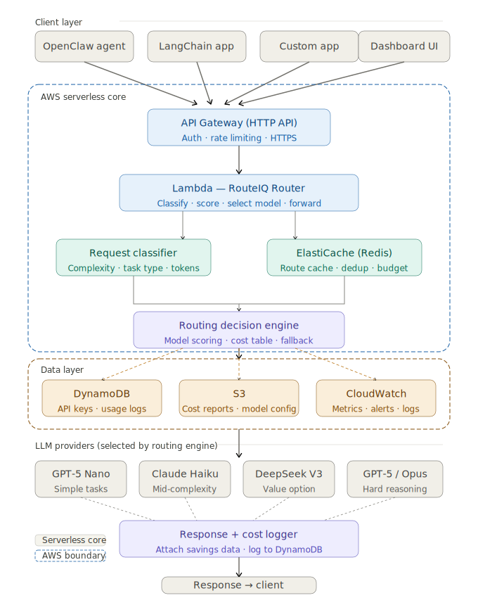
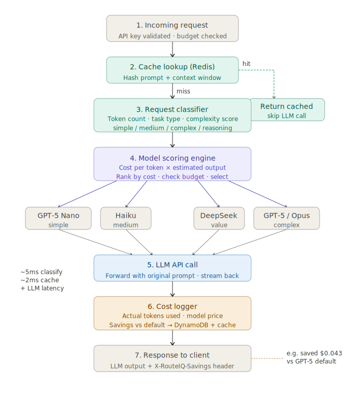

# RouteIQ — LLM Cost Optimizer

<p align="center">
  
</p>

> Stop paying for a sports car when you need a bicycle. RouteIQ automatically routes each AI request to the cheapest model that can handle it — saving 50–90% on LLM costs with zero code changes.

## Demo

<p align="center">
  <a href="https://github.com/STV1222/RouteIQ/releases/download/v1.0.0/RouteIQ_demo.mov">
    
    <br/>
    <strong>▶ Click to watch demo</strong>
  </a>
</p>

---

## The Problem

Every team using LLMs eventually hits the same wall: the bill.

The typical solution is to pick one model and use it for everything — GPT-4o, Claude Sonnet, Gemini Pro. It's simple. It's also expensive, because you're paying premium prices for tasks that don't need premium models.

**"What is 2+2?"** costs the same as **"Analyze the architectural trade-offs of our entire system."**

That's a 100x overpay on simple requests.

The alternative — manually routing different tasks to different models — means:
- Rewriting prompt logic for every use case
- Managing 4+ API keys and SDKs
- Re-evaluating every time a new model releases
- Breaking every existing integration

**So most teams just don't bother. And overpay by 5–10x every month.**

---

## How RouteIQ Solves It

RouteIQ is a proxy that sits between your app and the LLM providers. It looks like OpenAI to your app, but intelligently routes each request behind the scenes.

```
Your App
   │
   │  POST /v1/chat/completions
   │  model: "gpt-5.4"   ← you always send this
   ▼
RouteIQ
   │
   ├─ Classify request complexity in <5ms (no LLM call)
   ├─ Score it 0–100
   ├─ Pick cheapest model that handles that score
   └─ Return OpenAI-compatible response
   
   "What is 2+2?"              → gemini-2.5-flash-lite  ($0.000002)
   "Write a quicksort"         → deepseek-v3            ($0.000180)
   "Analyze system trade-offs" → claude-sonnet-4-6      ($0.002400)
```

**Your code doesn't change. Your bill drops 50–90%.**

---

## Live Demo

```python
from openai import OpenAI

# Change 2 lines. Everything else stays identical.
client = OpenAI(
    base_url="https://YOUR_ROUTEIQ_URL/v1",
    api_key="riq-your-key"
)

response = client.chat.completions.create(
    model="gpt-5.4",  # RouteIQ picks the actual model
    messages=[{"role": "user", "content": "What is 2+2?"}]
)

print(response.choices[0].message.content)       # 4
print("Model used:", response.model)              # gemini-2.5-flash-lite
print("Saved:", response.routeiq_savings_usd)     # $0.002408 (99% cheaper)
```

---

## Pain Points RouteIQ Eliminates

| Pain Point | Without RouteIQ | With RouteIQ |
|---|---|---|
| LLM cost | Pay GPT-4 prices for simple tasks | Pay per actual complexity |
| Multi-model complexity | 4+ SDKs, keys, integrations | One URL, one key |
| Model selection overhead | Manually classify every use case | Automatic, <5ms |
| Provider lock-in | Rewrite if you switch models | Change one config line |
| Spending visibility | No idea what's expensive | Per-request cost + savings dashboard |

---

## Routing Table

| Model | Provider | Input $/1M | Output $/1M | Handles (complexity score) |
|---|---|---|---|---|
| gemini-2.5-flash-lite | Google | $0.10 | $0.40 | 0–40 (simple tasks) |
| claude-haiku-4-5 | Anthropic | $1.00 | $5.00 | 0–60 |
| deepseek-v3 | DeepSeek | $0.28 | $0.42 | 0–75 (coding) |
| gpt-5.4 | OpenAI | $2.50 | $10.00 | 0–88 |
| claude-sonnet-4-6 | Anthropic | $3.00 | $15.00 | 0–95 (reasoning) |
| claude-opus-4-6 | Anthropic | $5.00 | $25.00 | 0–100 (agentic) |

### Complexity scoring (pure Python, no LLM needed)

| Category | Example | Score |
|---|---|---|
| Translation | "Translate to French: hello" | 15 |
| Summarization | "Summarize this article" | 20 |
| Classification | "Is this spam or ham?" | 25 |
| General | "What's the weather in Paris?" | 40 |
| Coding | "Write a quicksort function" | 70 |
| Reasoning | "Analyze trade-offs between X and Y" | 80 |
| Agentic | "Plan and execute this multi-step task" | 85 |

Long inputs get a bonus: +10 if >2,000 tokens, +15 if >6,000 tokens, capped at 100.

---

## Setup

### Option 1 — Local (Docker)

**Prerequisites:** Docker Desktop, [OpenRouter](https://openrouter.ai) API key (one key for all models)

```bash
git clone https://github.com/STV1222/RouteIQ.git
cd RouteIQ

cp .env.example .env
# Open .env and set:
#   OPENROUTER_API_KEY=sk-or-v1-...
#   USE_OPENROUTER=true

docker compose up -d
```

Create your first API key:
```bash
docker exec routeiq-app python3 -c "
import boto3
ddb = boto3.resource('dynamodb',
    endpoint_url='http://dynamodb-local:8000',
    aws_access_key_id='local',
    aws_secret_access_key='local',
    region_name='us-east-1')
ddb.Table('routeiq_api_keys').put_item(Item={
    'pk': 'riq-mykey-001',
    'api_key': 'riq-mykey-001',
    'user_id': 'me',
    'monthly_budget_usd': 100.0,
    'spend_this_month_usd': 0.0,
    'is_active': True,
    'default_model': 'gpt-5.4',
})
print('Key created: riq-mykey-001')
"
```

Test it:
```bash
curl -s -X POST http://localhost:8080/v1/chat/completions \
  -H "Authorization: Bearer riq-mykey-001" \
  -H "Content-Type: application/json" \
  -d '{"model":"gpt-5.4","messages":[{"role":"user","content":"What is 2+2?"}]}'
```

Dashboard: **http://localhost:8080/dashboard**

---

### Option 2 — AWS (production)

**Prerequisites:** [AWS CLI](https://aws.amazon.com/cli/), [SAM CLI](https://docs.aws.amazon.com/serverless-application-model/latest/developerguide/install-sam-cli.html)

```bash
# Install prerequisites (Mac)
brew install awscli aws-sam-cli

# Configure AWS credentials
aws configure

# Clone and build
git clone https://github.com/STV1222/RouteIQ.git
cd RouteIQ

sam build --template infra/template.yaml --use-container

# Deploy (interactive first time)
sam deploy \
  --stack-name routeiq \
  --region us-east-1 \
  --capabilities CAPABILITY_IAM \
  --resolve-s3 \
  --parameter-overrides \
    "OpenRouterApiKey=sk-or-v1-YOUR-KEY" \
    "SkipAuth=false" \
  --no-confirm-changeset
```

Your API URL appears in the output. Create a production API key:
```bash
aws dynamodb put-item \
  --region us-east-1 \
  --table-name routeiq_api_keys \
  --item '{
    "pk": {"S": "riq-prod-yourkey"},
    "api_key": {"S": "riq-prod-yourkey"},
    "user_id": {"S": "you"},
    "monthly_budget_usd": {"N": "500"},
    "spend_this_month_usd": {"N": "0"},
    "is_active": {"BOOL": true},
    "default_model": {"S": "gpt-5.4"}
  }'
```

---

## Use Cases

### Customer support chatbot
Simple FAQs go to the cheapest model. Complex escalations go to a capable model. No changes to your prompt code.

```python
response = client.chat.completions.create(
    model="gpt-5.4",
    messages=[{"role": "user", "content": user_message}]
)
# "What are your hours?" → gemini-flash (score 40, $0.000002)
# "Explain my 3-month billing dispute" → claude-sonnet (score 80, $0.002)
```
**Typical savings: 70–80%**

### Code review pipeline
Syntax checks route cheap. Architecture reviews route premium. Same function call.

```python
response = client.chat.completions.create(
    model="gpt-5.4",
    messages=[{"role": "user", "content": f"Review this code:\n{code}"}]
)
```

### Document processing at scale
Processing 10,000 docs/day? Most are simple classifications or summaries.

```
Before RouteIQ: $150/day (GPT-4o for every doc)
After RouteIQ:  $12/day  (right model per doc type)
```

### LangChain / AutoGen / CrewAI
Works as a drop-in — just change `base_url`:

```python
from langchain_openai import ChatOpenAI

llm = ChatOpenAI(
    base_url="https://YOUR_ROUTEIQ_URL/v1",
    api_key="riq-your-key",
    model="gpt-5.4"
)
# All agents benefit from smart routing automatically
```

### Multi-tenant SaaS
Issue one key per customer. Track spend and savings per customer. Set monthly budgets per key.

---

## What You See in Every Response

```json
{
  "choices": [{"message": {"content": "4"}}],
  "routeiq_model_used": "gemini-2.5-flash-lite",
  "routeiq_complexity_score": 40,
  "routeiq_complexity_category": "general",
  "routeiq_savings_usd": 0.002408,
  "routeiq_estimated_cost_usd": 0.000002,
  "routeiq_cache_hit": false
}
```

Response headers:
```
X-RouteIQ-Model: gemini-2.5-flash-lite
X-RouteIQ-Savings: 0.002408
X-RouteIQ-Complexity: 40
X-RouteIQ-Cache-Hit: false
```

---

## Dashboard

Hit `/dashboard` after connecting your API key to see:

- Total saved vs. what you would have paid
- Model distribution chart (what % of requests go where)
- Per-model savings breakdown
- Recent requests table with complexity scores and costs

---

## Advanced

### Force a model
```python
response = client.chat.completions.create(
    model="gpt-5.4",
    messages=[...],
    extra_body={"routeiq_force_model": "claude-opus-4-6"}
)
```

### Streaming
```python
stream = client.chat.completions.create(
    model="gpt-5.4",
    messages=[...],
    stream=True
)
for chunk in stream:
    print(chunk.choices[0].delta.content, end="")
```

---

## Architecture



## Request Lifecycle



---

## Running Tests

```bash
docker compose exec routeiq-app pytest tests/ -v
# 64 tests — classifier, scorer, gateway, cache, auth, fallback
```

---

## Project Structure

```
RouteIQ/
├── src/
│   ├── main.py                   # FastAPI app
│   ├── config.py                 # Model table + settings
│   ├── router/
│   │   ├── classifier.py         # Complexity classifier
│   │   ├── scorer.py             # Model selection
│   │   ├── forwarder.py          # Provider dispatch
│   │   └── gateway.py            # Orchestration
│   ├── providers/
│   │   ├── openrouter_provider.py
│   │   ├── openai_provider.py
│   │   ├── anthropic_provider.py
│   │   ├── deepseek_provider.py
│   │   └── gemini_provider.py
│   ├── api/
│   │   ├── routes.py
│   │   ├── auth.py
│   │   └── budget.py
│   ├── cache/redis_cache.py
│   ├── storage/dynamo.py
│   └── static/dashboard.html
├── tests/
├── infra/
│   ├── lambda_handler.py
│   ├── template.yaml             # SAM / CloudFormation
│   └── deploy.sh
├── docker-compose.yml
├── Dockerfile
└── requirements.txt
```

---

## License

MIT — see [LICENSE](LICENSE)
